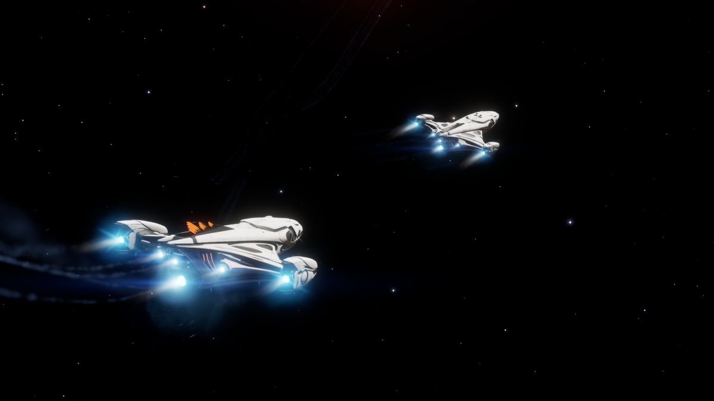
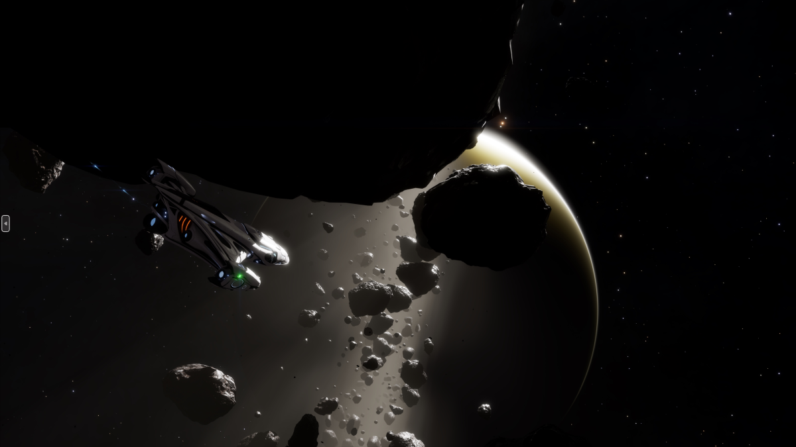

# Engineering Commodities

With Engineers, there are a list of commodities that are used to unlock engineers, used in unlocking recipes for experimental modules.

## Required Rare Goods

Rare goods are commodities that are sold in limited quantities and are only available at specific locations.

| Commodity | Limit | Source | Engineer Requirement |  
| --------- | ----- | ------ | -------------------- |
| Soontil Relics | 5 | Ngurii, Cheranovsky City | Elvira Martuuk |
| Kongga Ale | 16 | Kongga, Laplace Ring | Lori Jameson |
| Xihe Companions | 10 | Xihe, Zhen Dock | Zacariah Nemo |
| Lavian Brandy | 12 | Lave, Lave Station | Didi Vatermann |
| Kamitra Cigars | 23 | Kamitra, Hammel Terminal | Hera Tani |
| Fujin Tea | 23 | Fujin, Futen Spaceport | Broo Tarquin |

## Mined Minerals & Metals

Mined minerals & metals are obtained through mining. These materials cannot be purchased from commodity markets.

| Commodity | Category | Source |
| --------- | -------- | ------ |
| Bromellite | Mineral | Icy Rings, Commonly found in Alexandrite Hotspots. |
| Osmium | Metal | Pristine Metallic Rings |
| Painite | Mineral | Metal Rich & Metallic Rings |

## Market & Mission Rewards

Market & Mission Rewards commodities can be bought from station markets or be obtained from completing missions.

| Commodity | Category | Source |
| --------- | -------- | ------ |
| Articulation Motors | Machinery | Mission Reward |
| CMM Composites | Industrial |  |
| Emergency Power Cells | Machinery |  |
| Energy Grid | Machinery |  |
| Exhaust Manifold | Machinery |  |
| Hardware Diagnostic Hardware | Machinery |  |
| Heatsink Interlink | Machinery |  |
| HN Shock Mount | Machinery | Traded from EIC PMF. |
| Ion Distributor | Machinery |  |
| Insulating Membrane | Industrial |  |
| Landmines | Weapons | Found at Military Economy Planetary Stations. |
| Magnetic Emitter Coil | Machinery |  |
| Micro Controller | Machinery |  |
| Micro Weave Cooling Hoses | Industrial | Mission Reward |
| Modular Terminals | Machinery | Mission Reward, traded from EIC PMF. |
| Nanobreakers | Technology | Mission Reward |
| Neofabric Isolators | Industrial | Mission Reward |
| Power Converter | Machinery |  |
| Power Transfer Bus | Machinery |  |
| Progenitor Cells | Medicine |  |
| Occupied Escape Pods | Salvage | Obtained at Distress Signals, Hunter-class Thargoids and Wanted Ships. |
| Radiation Baffle | Machinery |  |
| Reinforced Mounting Plate | Machinery | Traded from EIC PMF. |
| Telemetry Suite | Machinery | Mission Reward |

## Xeno Related Commodities

Xeno-related commodities can be obtained only at xenological activities, structures and destroying it's xenological species. 

| Commodity | Category | Source |
| --------- | -------- | ------ |
| Meta Alloy | Thargoid | Barnacle Roots, Bought from Fleet Carriers or Darnielle's Progress in Maia. |
| Thargoid Sensor | Thargoid | Interceptors Crashed Sites |
| Thargoid Probe | Thargoid | Interceptors NHSS |
| Thargoid Link | Thargoid | Surface Site Link Chamber |
| Thargoid Heart | Thargoid | Destroying an Interceptor |
| Unclassified Relic | Hybrid | Feed a Surface Site with Relics |
| Ancient Key | Guardian | Obtained from Guardian Beacons |
| Guardian Relic | Guardian | Obtained from Guardian Structures, Ancient Ruins |
| Thargoid X Tissue Sample | Thargoid | Probing Interceptor, Hunter, Scouts |
| Titan Tissue Sample | Thargoid | Probing a Live Titan Megaship |
| Titan Maw Tissue Sample | Thargoid | Probing a Live Titan's Maw |
| Caustic Tissue Sample | Thargoid | Probing a Caustic Generator |
| Impure Spire Compound | Thargoid | Protruding Sacs at Spire Sites |
| Semi-Refined Spire Materia | Thargoid | Central Spires at Spire Sites |
| Coral Sap | Thargoid | Coral Structures at Spire Sites |
| Refined Spire Material | Thargoid | Petal Terminal on Central Spire at Spire Sites |

