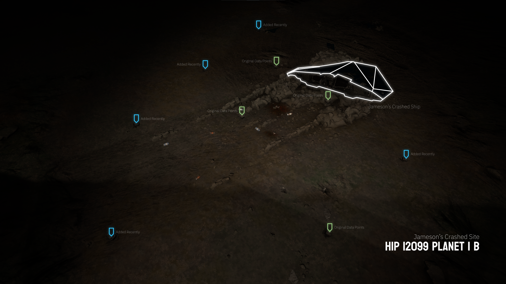
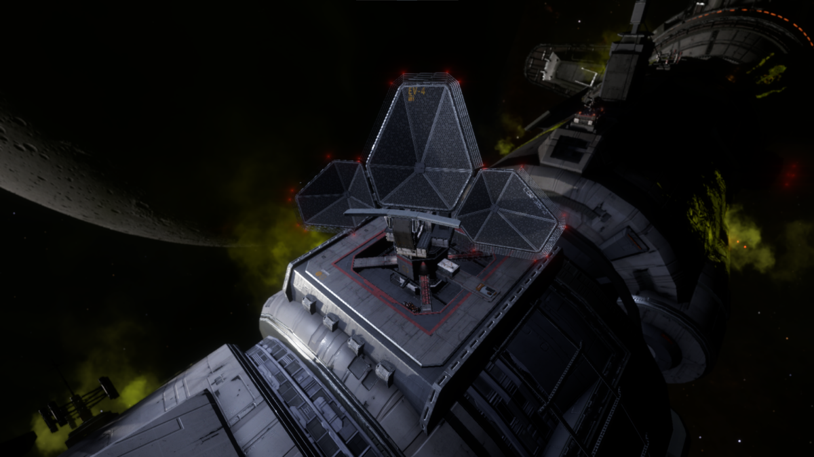

# Encoded Materials

Encoded materials can be obtained from scanning anything that emits an emission. Examples of anything that transmits these emission type signals can be Wake Signal Sources, Encoded Emissions, and from scanning data points and security beacons. Encoded telemetry are rarer to find as there are not a lot of resources that encoded materials can be obtained from. 

## Jameson Crashed Site



The most popular site to visit to collect encoded materials from is Jameson's Crashed Site. A short visitation with a datalink scanner will yield you enough encoded resources. Jameson Crashed Site is as the name suggest, a planetary point of interest, featuring the pilot CMDR Jameson at which you piloted as this character in Frontier: First Encounters. The Crashed site has 9 scannable data points.(1)
{.annotate}

1.  An additional 5 datapoints were introduced during the Quality of Life update for engineering. Originally there are only 4 data beacons.

<div class="grid cards" markdown>

-   Collection Method

    ---

    !!! tip "SRV is not Required!"

        You can scan all 9 data points without the need of an SRV, contrary to popular belief. As long as you choose a ship where the cockpit is relatively in the front of the ship, then you can use the ship's on-board data link scanner utility to scan all 9 data points.

        
-   Location of Site

    ---

    You can find Jameson's Crashed Site here:

    ```
    HIP 12099
    ```
    Planet 1 B
    ```
    -54.3735, -50.3516
    ```

</div>

## Encoded at Megaships



You can collect encoded materials at various megaships. You do need a Recon Limpet Controller.(1) Hacking the data terminal will yield a collection of various encoded materials. There are two megaships at which you can obtain these batches of encoded materials.(2)
{.annotate}

1.  Using a Recon Limpet Controller is considered an illegal activity in a system with a security level present.

2. Aberrant Shield Pattern Analysis, Anomalous Bulk Scan Data, Classified Scan Databanks, Classified Scan Fragment, Cracked Industrial Firmware, Distorted Shield Cycle Recording, Divergent Scan Data, Inconsistent Shield Soak Analysis, Modified Embedded Firmware, Open Symmetric Keys, Peculiar Shield Frequency Data, Security Firmware Patch, Tagged Encryption Codes, Unidentified Scan Archives, Untypical Shield Scans, Unusual Encrypted Files.


<div class="grid cards" markdown>

-   Cave Johnson Memorial Research Lab

    ---

    This Megaship will constantly be on the move from in between systems. Once it is in an Anarchy system, you will be able to hack its data point for encoded materials. Relog to repeat this action.


-   Far God Megaship: The Dedicant

    ---

    This Megaship is located in `HIP 19600` as an abandoned, destroyed megaship. Scanning its datapoints will cause it to launch defensive measures. Stay cold and you can avoid these targeting you.

</div>