# Guardian Blueprint

Guardian Blueprint Fragments are a grade 5 encoded material only obtainable from Guardian Structures with a terminal present. In this tutorial, we will go over as two how to obtain these rare Guardian Blueprint Fragments.

## Requirements

Before going for these Guardian Blueprint fragment, it is recommended that you completed and have made improvements to your Frame Shift Drive module with Felicity Farseer. You will also need a jump capable ship with the following modules:

* A Fuel Scoop
* A Cargo Rack of at least 2 Ton of space
* 2 SRV's or a hanger bay that can equip two SRV's
* A Detailed Surface Scanner
* A Point Defense Utility Slot
* A Shield Generator and Shield Boosters
* A Thermal Based weapon (Vessel Blueprints only)
* Collector Limpet Controller (Vessel Blueprints only)

## Obtaining the Ancient Key / Relic

There are two different types of Guardian relics that one's able to obtain, and this will determine which system you will need to plot to.

<div class="grid cards" markdown>

-   __Module Blueprint Type__

    ---

    Plot to the system:
    ```
    Synuefe NL-N c23-4
    ```
    And fly to planet B 3.

-   __Weapon Blueprint Type__

    ---

    Plot to the system:
    ```
    Synuefe GV-T b50-4
    ```
    And fly to planet B 1.

    ??? warning "Alternative Location"

        You may choose to plot to the old location for where the more popular Guardian Weapons blueprint site is.
        ```
        Synuefe EU-Q c21-10
        ```
        However, the GV-T system has the fastest loop to obtaining the most Guardian Weapons blueprint type, making it a far better place to farm for weapon type blueprints.

</div>

??? info "For Vessel Blueprint Type"

    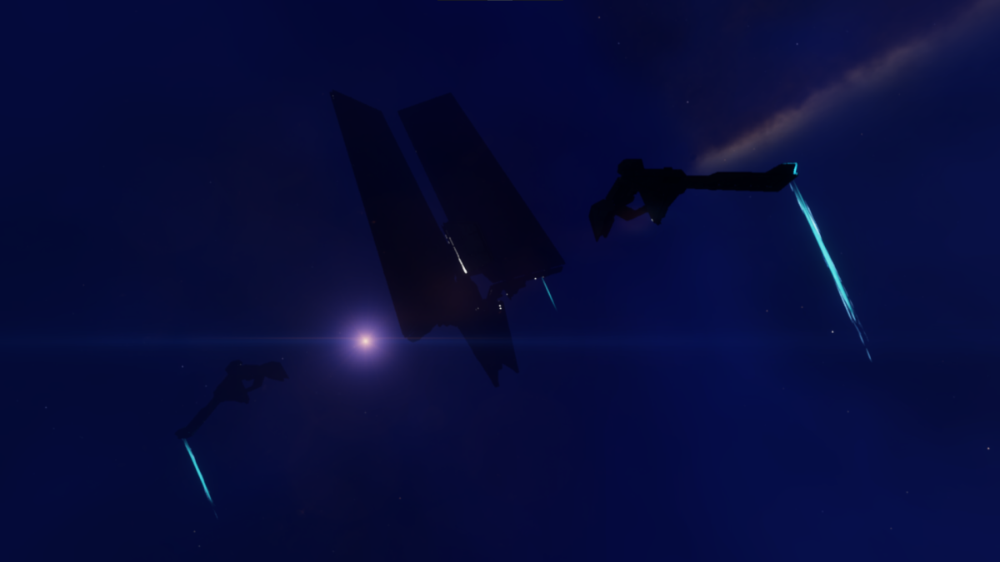

    If you are headed for the Vessel Blueprint Type, you need to head to a system where there is a Guardian Beacon. Guardian Beacons are required to be visited if you so choose the unlock one of the three or all of the Guardian ship launched fighters. Plot to the system:
    ```
    Synuefe KU-F b44-4
    ```
    And head to planet A 4.

    Around here, you will locate a point of interest marker for the Guardian beacon. This beacon will be a huge Guardian monolith that will orbit the planetary body. Fly towards it and drop into the location, then fly towards the structure once you have dropped into the location. 

    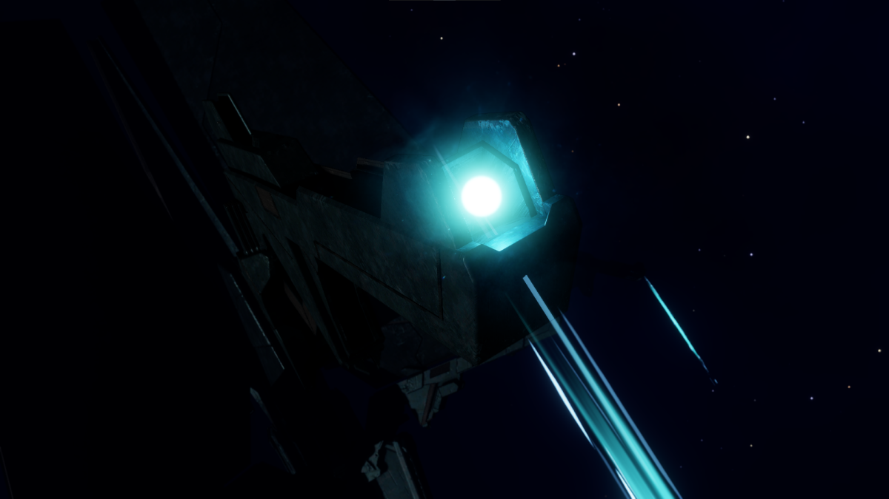

    These Guardian Energy Source arms will extend from the Guardian Beacons allowing you to charge it up with your thermal based weapon. There will be three locations on your minimap that will need to be charged. Once all 3 energy sources are charged up, enjoy the lightning show and wait for the Beacon to expose it's data orb.
    
    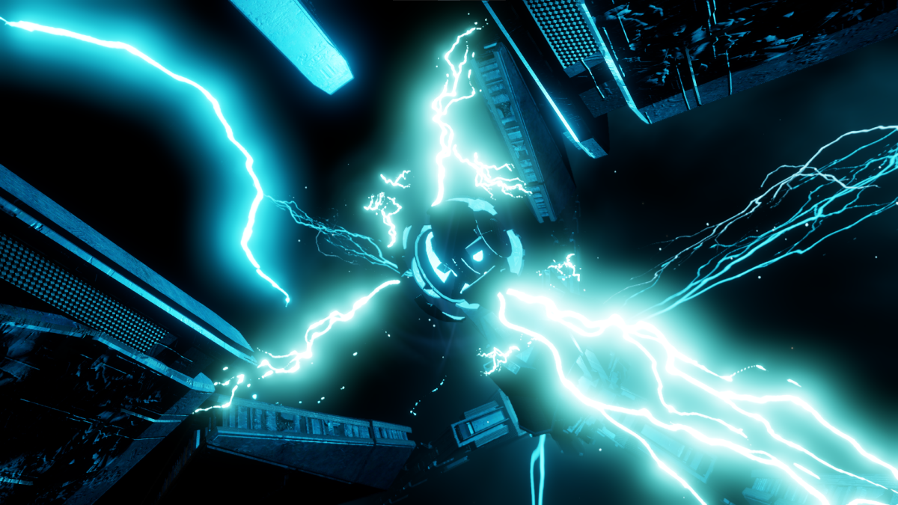 
    
    Scanning the Beacon's data orb will have the beacon jettison an Ancient Key at the base of the beacon. You will see this on your map. It is recommended the nudge the key away from the structure with your ship before collecting it manually with your collector limpet or by manually scooping it up. 
    
    
    
    You will also be sent to another system at which you can use the Ancient Key to unlock the Vessel Blueprint. You will be sent information to this location:
    ```
    Synuefe EU-Q C21-15
    ```
    And head to planet A 1.

Scan the body with your Detailed Surface Scanner, until you see the Guardian Structure point of interest marker show up in your Navigations panel. You will be asked to glide down from orbit cruise to this location on the surface of the planet. Land relatively close to the Structure, but not so close where it may obstruct the functionalities of your SRV.

<div class="grid" markdown>

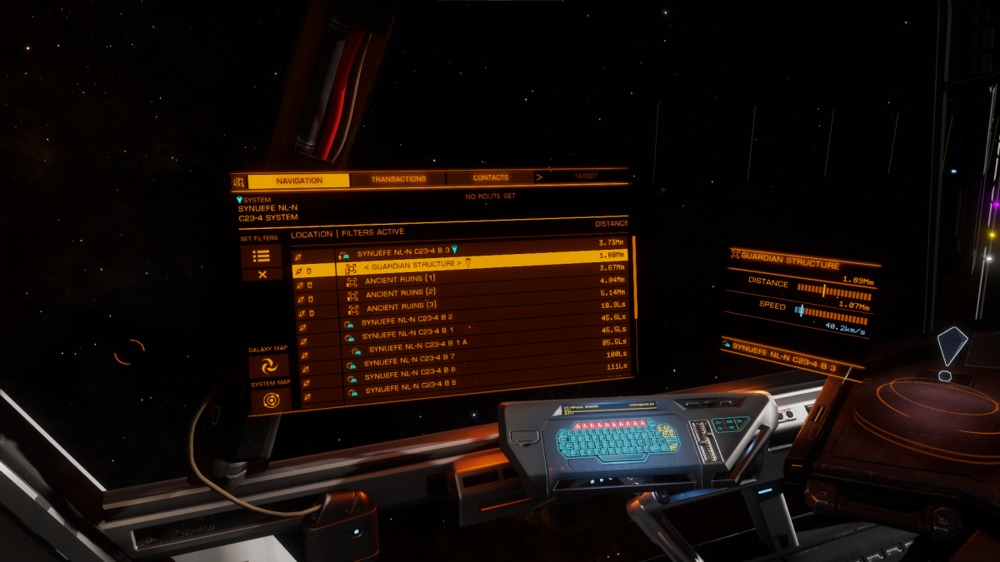

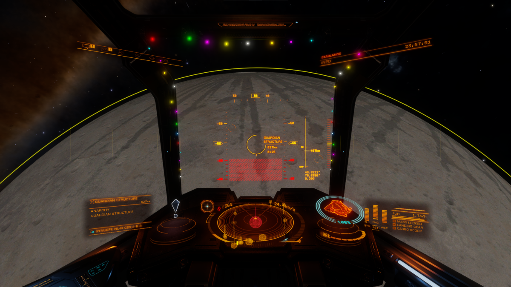

</div>

Deploy your SRV and start driving around. You will try to find a stucture that will come out of the ground. Shoot the top of the monolith and dislodge the outer shell and then dislodging the Ancient relic. You will need to keep this relic safe throughout the duration of the puzzle.

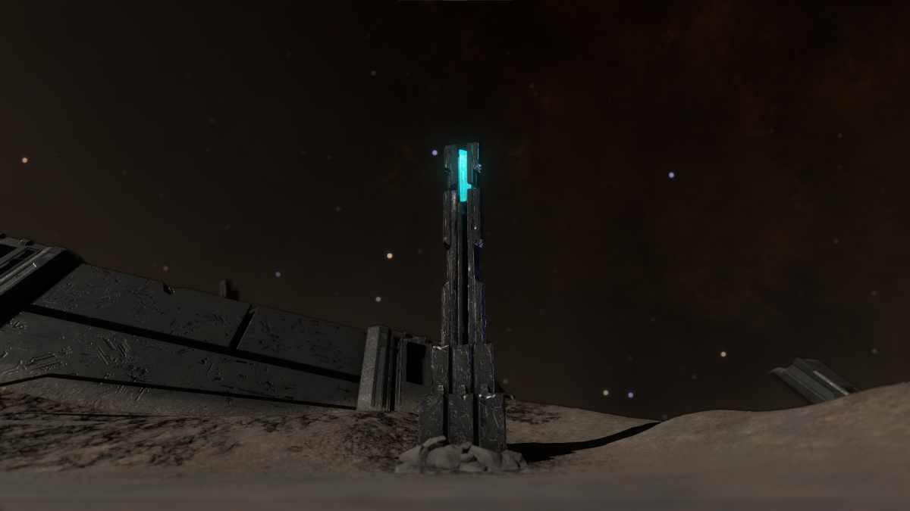

Looking around, you should notice a few things. Guardian Structures will always have a centralized Terminal, six dormant pylons in which you will need to activate, and spots where Guardian Sentinets will deploy and protect the structure from intruders.

## Guardian Sentinels

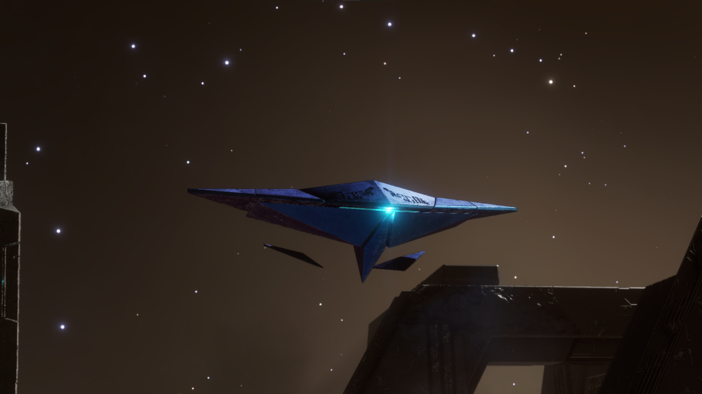

These Guardian Sentinels. They are drones that defend the Structure site from any intruders. Although mostly harmless, they can be dispatched by using your SRV's energy repeaters. They can become problematic if too many show up. Guardian Sentinels will shoot slow hovering projectiles towards you, and they will also have the ability to launch missiles. Hopefully your ship has equipped a Point Defense utility slot to protect you from these missiles. 

Destroying Sentinels can yield sentinel-related material drops.

## Guardian Pylons

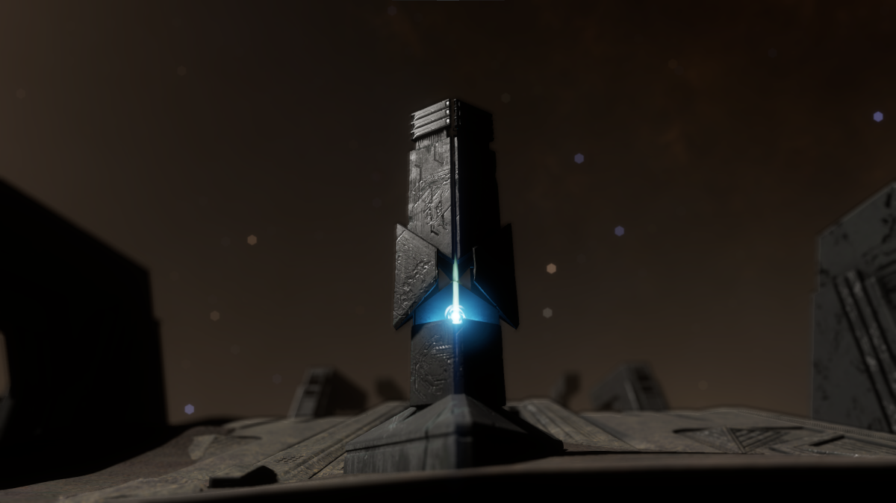

Every Guardian Structure has six pylons. You must visit the Terminal to activate the pylons. This may warrant Guardian Sentinels to respond. If this is your first time visiting the Guardian sites, go drive around the Guardian Structure in the SRV and explore the structure site, noting where all of the pylons are. It is a good idea that you activate all 6 pylons before you go and begin charging them, since all 6 pylons will need to be charged before the count-down timer reaches 0 and the pylons will need to be re-charged to activate the terminal. Charging all 6 pylons will dispatch another group of Guardian Sentinels to respond.

??? info "Synuefe NL-N c23-4 Pylon Locations"

    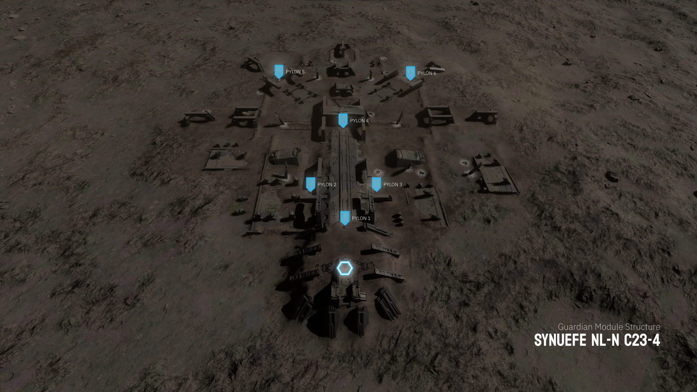

??? info "Synuefe GV-T b50-4 Pylon Locations"

    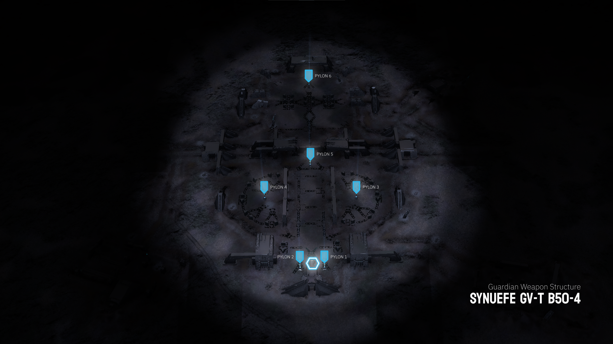

??? info "Synuefe EU-Q c21-15 Pylon Locations"

    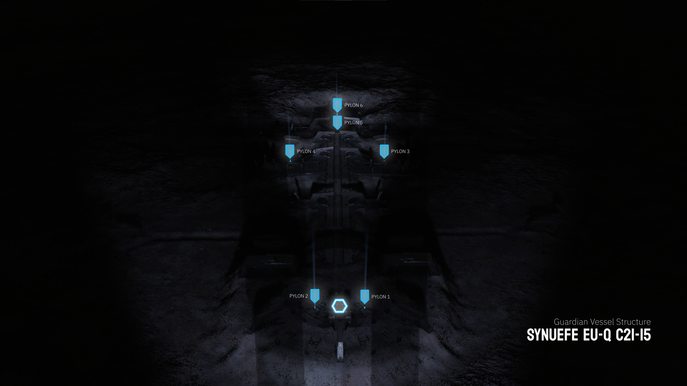

## Guardian Terminal

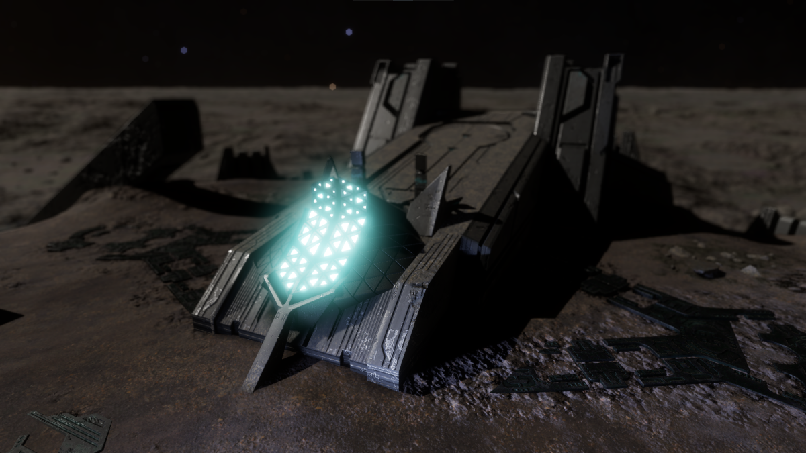

The guardian terminal is the point where you can scan for the Blueprint fragment. Each Guardian Structure will have a different blueprint fragment type. To activate this terminal, you need an Ancient Key or Relic, and have all 6 pylons activated and charged. 

## Guardian Terminal Orb


After charging all 6 pylons, you will need to drive to the **X** marked in front of the terminal. From here, you will need to either Jettison or Abandon your Ancient Key or Relic to activate the terminal. 

??? info "Vessel Blueprint Ancient Key" 

    If you have obtained an Ancient Key from the Guardian Beacon, you must use this key to access and activate the Guardian terminal. This terminal will reject all ancient relics found on the surfaces of this Guardian structure.


An activated terminal will have an orb be deployed for scanning. You can use your Data-Link Scanner to scan this orb to obtain one piece of the Blueprint Fragment. Successfully scanning the orb will dispatch a final wave of Guardian Sentinels to respond. You can ignore these and enter the safety of your ship, or destroy them for materials. 

!!! warning "Scanning Limit"

    There is a **limit** of one Blueprint Fragment, per individual, per instance; meaning, if you wish to obtain multiple blueprints, you must restart the process, by logging to main menu, to obtain several copies. 

## Summary of Actions

Let's review what you need to do in order to obtain your Blueprint Fragments:

1. Obtain an Ancient Key from a Guardian Beacon or an Ancient Relic from a Guardian Structure.
2. Reach the terminal and activate the Pylons.
3. Drive around and eliminate all Guardian Sentinel threats.
4. Activate all pylons.
5. Begin charging all six pylons with your SRV's turrets.
6. Dispatch all Guardian Sentinel threats.
7. Drop the Ancient Key or Relic on the `X` near the terminal.
8. Scan the orb that gets deployed from the terminal.
9. Destroy the remaining Guardian Sentinels or flee.

