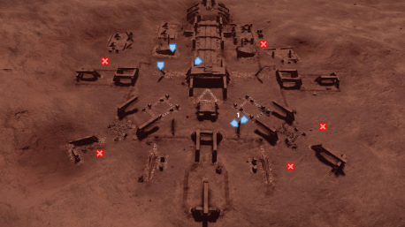

# Guardian Components

Guardian materials can be obtained anywhere in space where there is Guardian constructs. In categories of only Manufactured and Encoded materials, you can find Guardian resources around any Guardian ruins or structures. Guardian materials can not be cross traded for any other materials. Most of the Guardian weapons are used to unlock Guardian-related AX weapons and experimental modules. Guardian materials are also used for synthesis for Guardian-specialized modules.

## Guardian Manufactured Materials

| Material | Rarity | Drop Location |
| -------- | ------ | ------------- |
| Guardian Power Cell | G1 | Obtained from Destructible Panels / Destroying Guardian Sentinels |
| Guardian Power Conduit | G2 | Obtained from Destructible Panels / Destroying Guardian Sentinels |
| Guardian Technology Component | G2 | Obtained from Destructible Panels |
| Guardian Sentinel Weapon Part | G2 | Obtained from Destroying Guardian Sentinels |
| Guardian Wreckage Component | G1 | Obtained from Destroying Guardian Sentinels |


!!! info "Guardian Technology Components"

    Farming Guardian Technology can be quite a challenging process to gather lots. There are two sites that has good yield of these rare Guardian Technology Components. Sometimes dislodging Guardian Technology Components from destructible panels may launch the material into the air due to a collision bug.

    <div class="grid cards" markdown>

    -   __Synuefe NL-N C23-4 Planet B 3__

        ---

        

        There are a total of 5 Guardian Sentinel Spawn points with 3-5 Guardian Technology Components guaranteed to drop. `X` marked locations are where Sentinels are spawned.


    -   __Synuefe HT-F D12-29 Planet C 3__

        ---

        

        There are a total of 4 Guardian Sentinel Spawn points with 6-8 Guardian Technology Components guaranteed to drop. `X` marked locations are where Sentinels are spawned.

    </div>

## Guardian Encoded Materials


All Guardian encoded materials can be only found by scanning active monoliths. Each encoded pattern types will be randomly obtained after being scanned with your ship's or SRV's data link scanners.

| Material | Rarity | Notes |
| -------- | ------ | ----- |
| Alpha Pattern Obelisk | G3 |  |
| Beta Pattern Obelisk | G2 |  |
| Gamma Pattern Obelisk | G1 |  |
| Delta Pattern Obelisk | G4 |  |
| Epsilon Pattern Obelisk | G4 | This pattern type is hard to find. |
| [Guardian Blueprint Fragment ](../collection/guardianblueprint.md) | G5 | Tutorial on obtaining this data. |

Obelisk data can be found at both Guardian Structure Sites and Ancient Ruins. Although the abundance of active Obelisk monoliths are increased if searched at Ancient Ruins.

???+ info "Obelisk Pattern Data"

    The recommended system to obtaining clusters of Obelisk data can be found here.
    ```
    Synuefe XR-H d11-102
    ```
    Planetary Body 1 B, locate and fly to Ancient Ruin site 1.

    Four relatively close obelisks align close to each other, making quick scan to obtain random obelisk pattern data. Look for two, 3 x 6 array of obelisk side by side. 


## Guardian Structure Commodities


There are a bunch of Guardian salvage commodities scattered around the ruins. These commmodities are not worth very much and commodities required by Ram Tah, [in his side quest](https://canonn.science/codex/ram-tahs-mission/) for obtaining information regarding the Guardians. These salvage commodities are not used in any known crafting recipes.

## Important Guardian Bookmarks

Here are a list of systems that you should bookmark. Each guardian site has it's own unique feature.

| System Name | Body | Site Type | Features |
| ----------- | ---- | --------- | -------- |
| Synuefe EN-H d11-96 | 7 A / 9 A | Outposts | System with Technology Brokers. |
| Synuefe PJ-X C25-8 | 7 A | Module | Closest Module Structure Site to the bubble. |
| Synuefe NL-N C23-4 | B 3 | Module | 5 Guardian Technology Components can be obtained here. |
| Synuefe GV-T B50-4 | B 1 | Weapon | Best guardian site for farming Weapon Blueprints. |
| Synuefe KU-F B44-4 | A 4 | Beacon | Sometimes the key gets lodged if you collect it with a collector limpet. |
| Synuefe EU-Q C21-15 | A 1 | Vessel | Lots of Guardian Sentinels guarding this site. |
| Vela Dark Region KR-W c1-24 | 7 A | Obelisk | 4 active obelisks in small groupings, making it easier to scan. |
| Synuefe HT-F d12-29 | C 3 | None | 8 Technology Components can be obtained here. |

