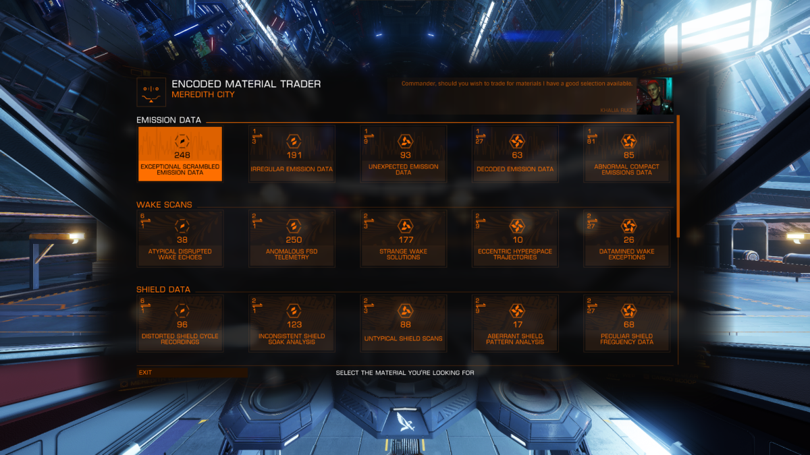
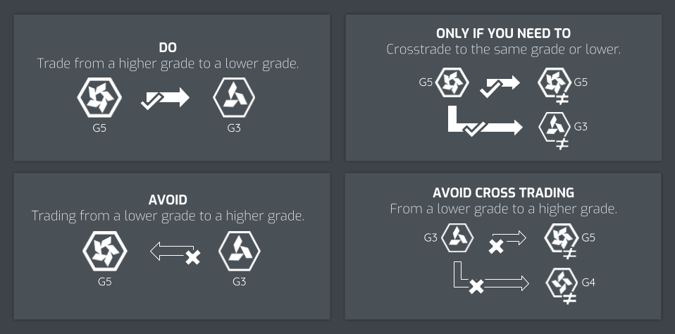
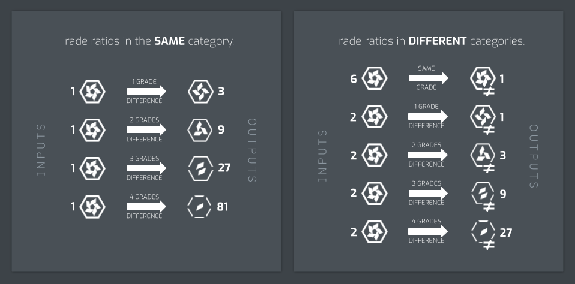
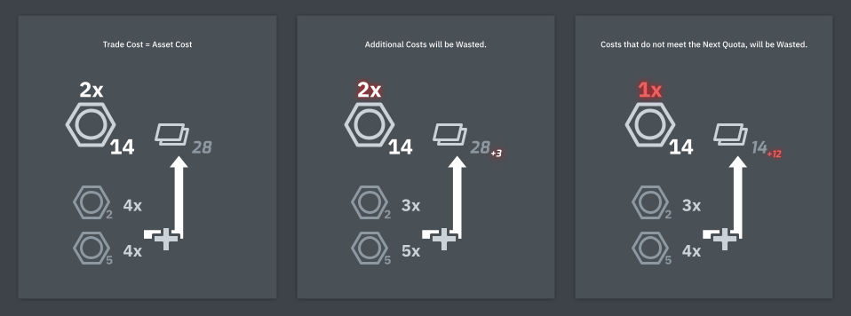

# Materials Trader

Materials Trader are services granted to the player when accessing the station. Not all stations will have these services and so it is recommended to search for a station that has the services.

## Horizons Materials Trader

In Horizons, Material Traders trade only a category of materials(1). It is intuitive most Encoded specialized material traders can be found at stations with High-Tech economy, Manufactured specialized material traders can be found at stations with Industrial, or Agricultural economies, and Raw specialized material traders can be found at stations with Extraction economies. 
{.annotate}

1.  Materials cannot be traded to other types of materials, i.e. you cannot trade an abundance of Raw materials to Manufactured materials.

### Material Trading Ratios

When trading materials within the same category, be mindful of the trading ratio. Some best practices to adhere to are:

* always trade from a higher grade to a lower grade
* if absolutely need to, trade across each subcategory of material of the same grade or to a lower grade

Some bad practices to avoid to prevent losing materials:

* avoid trading from a low grade to a higher grade
* avoid cross-trading materials from a lower grade to a higher grade

These are the trade ratios when you trade down from a higher grade to a lower grade. Trade ratios apply to every material type, material category, and every grade differences. Cross trading ratios apply to all types of materials.(1)
{.annotate}

1.  Trading up ratios are not shown since you will lose materials as the trade ratios are horrible. It is avoided at all costs.

## Odyssey Bartender

Odyssey Bartenders are able to trade only asset category(1)materials. Bartenders can be found in the main lounge of Odyssey settlements. 
{.annotate}

1.  Asset category materials are, Circuits, Chemicals, and Tech materials.

### Dealing with a Bartender

When dealing with a Bartender, you will be trading for the material's bartending cost. An exchange will be made when a combination of different asset's bartending values, are added and meet the exchanging material's bartending cost. 

The amount of units you receive is based on the quotient from the total value of your trade pool's total value, divided by the asset's bartending cost.

