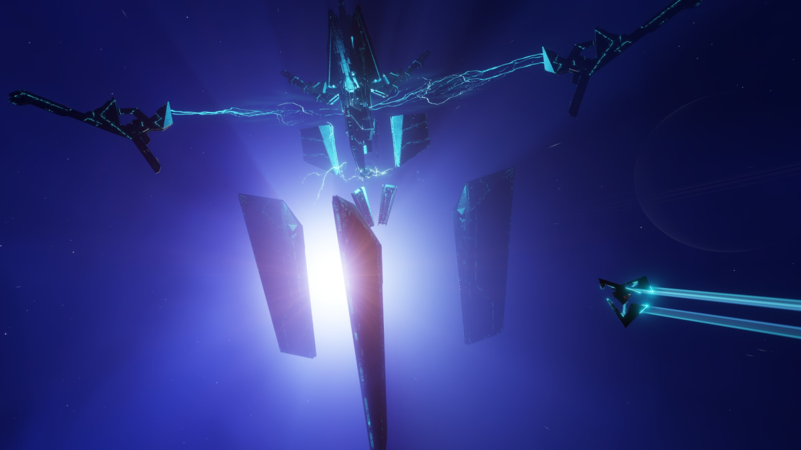
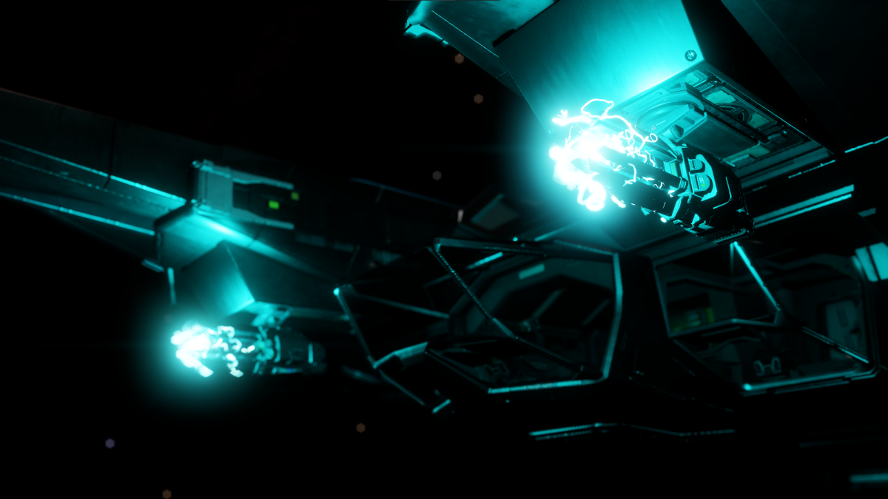

# Technology Brokers

Technology Brokers are a dealer service found commonly in stations in high populated, and high security systems. There are some experimental and hybrid modules in Elite Dangerous that can only be access after unlocking it with a Technology Broker. These modules and weapons are all unlocked with a recipe. Some modules and weapons are a permanent unlock that allows the player to access it with credits, while some modules and weapons can only be purchased with a set of materials and commodities. Technology brokers are also broken up into two types. Pre-engineered items can also be unlocked through a Technology Broker. 

* Human Technology Brokers that can unlock experimental modules and weapons such as thargoid-hybrid derivatives.
* Guardian Technology Brokers are ones who specialize in unlocking Guardian-hybrid modules and weapons.

## Permanent Unlocks



Here is the list of all recommended experimental and guardian hybrid, module and weapon permanent unlocks.

### Human Experimental Modules and Weapons

<div class="grid cards" markdown>

-   __Caustic Sinks__

    ---
    
    ```
    5 Caustic Tissue Sample

    10 Galvanizing Alloys
    10 Corrosive Mechanisms
    15 Chemical Storage Units
    20 Caustic Shards
    ```

- __Corrosive Resistant Cargo Racks__

    ---

    ```
    16 Meta Alloys
    22 Radiation Baffle
    12 Neofabric Insulation

    26 Iron
    18 Chemical Manipulators
    ```

</div>

### Guardian Hybrid Modules and Weapons

<div class="grid cards" markdown>

-   __Small Guardian Gauss Cannon__

    ---

    ```
    1 Guardian Weapon Blueprint Fragment
    12 Guardian Power Conduit
    12 Guardian Wreckage Components
    15 Guardian Sentinel Weapon Parts
    ```

-   __Medium Guardian Gauss Cannon__

    ---

    ```
    6 Magnetic Emitter Coil
    
    1 Guardian Weapon Blueprint Fragment
    18 Guardian Power Cell
    20 Guardian Technology Component
    15 Manganese
    ```

-   __Guardian Module Reinforcement Package__

    ---

    ```
    9 Reinforced Mounting Plate

    1 Guardian Weapon Blueprint Fragment
    18 Guardian Wreckage Components
    15 Pattern Epsilon Obelisk Data
    20  Guardian Power Conduit
    ```

-   __Guardian Shield Reinforcement Package__

    ---

    ```
    8 Hardware Diagnostic Sensor

    1 Guardian Module Blueprint Fragment
    17 Guardian Power Cell
    20 Guardian Technology Component
    24  Pattern Delta Obelisk Data
    ```

-   __Guardian Hull Reinforcement Package__

    ---

    ```
    12 Reinforced Mounting Plate

    1 Guardian Module Blueprint Fragment
    21 Guardian Sentinel Wreckage Components
    16 Pattern Beta Obelisk Data
    16 Pattern Gamma Obelisk Data
    ```

-   __Guardian Frame Shift Drive Booster__

    ---

    ```
    8 HN Shock Mount

    1 Guardian Module Blueprint Fragment
    21 Guardian Power Cell
    21 Guardian Technology Component
    24 Focus Crystals
    ```

</div>

## Unlock by Purchase

Here is the list of all recommended experimental and guardian hybrid, module and weapon unlock by purchase.



### Human Experimental Module and Weapons

<div class="grid cards" markdown>

-   __Sirius Heatsink__

    ---

    ```
    8 Mechanical Scrap
    8 Niobium
    6 Vanadium
    5 Mechanical Components
    ```

-   __V1 Detailed Surface Scanner__

    ---

    ```
    24 Niobium
    28 Mechanical Components
    22 Germanium
    26 Mechanical Scrap
    ```

-   __TG Pulse Neutralizer__

    ---

    ```
    1 Unclassified Relic

    5 Massive Energy Surge Analytics
    5 Propulsion Elements
    5 Sensor Fragment
    ```

-   __Medium Azimuth Enhanced AXMC__

    ---

    ```
    9 Iron
    11 Zirconium
    6 Bio-Mechanical Conduits
    7 Wreckage Components
    14 Weapon Parts
    ```

-   __Large Azimuth Enhanced AXMC__

    ---

    &nbsp;    
    ```
    11 Iron
    16 Zirconium
    9 Bio-Mechanical Conduits
    12 Wreckage Components
    17 Weapon Parts
    6 Ship System Data
    ```

-   __V1 SCO Frame Shift Drive__

    ---

    === "Size 2A"

        ```
        1 Titan Drive Component
        10 Datamined Wake Exceptions
        14 Tellurium
        6 Electrochemical Arrays
        9 Chemical Processors
        4 Propulsion Elements
        ```

    === "Size 3A"

        ```
        1 Titan Drive Component
        12 Datamined Wake Exceptions
        16 Tellurium
        9 Electrochemical Arrays
        11 Chemical Processors
        5 Propulsion Elements
        ```

    === "Size 4A"

        ```
        1 Titan Drive Component
        13 Datamined Wake Exceptions
        20 Tellurium
        9 Electrochemical Arrays
        13 Chemical Processors
        6 Propulsion Elements
        ```
    
    === "Size 5A"

        ```
        1 Titan Drive Component
        15 Datamined Wake Exceptions
        24 Tellurium
        12 Electrochemical Arrays
        14 Chemical Processors
        7 Propulsion Elements
        ```

    === "Size 6A"

        ```
        1 Titan Drive Component
        15 Datamined Wake Exceptions
        28 Tellurium
        12 Electrochemical Arrays
        16 Chemical Processors
        8 Propulsion Elements
        ```

    === "Size 7A"

        ```
        1 Titan Drive Component
        16 Datamined Wake Exceptions
        28 Tellurium
        14 Electrochemical Arrays
        18 Chemical Processors
        12 Propulsion Elements
        ```

</div>

### Guardian Hybrid Modules and Weapons

<div class="grid cards" markdown>

-   __Medium Modified Guardian Plasma Charger__

    ---

    ```
    2 Power Transfer Bus

    1 Guardian Weapon Blueprint Fragment
    5 Guardian Power Conduit
    5 Guardian Sentinel Weapon Parts
    4 Arsenic
    ```

-   __Medium Modified Guardian Shard Cannon__

    ---

    ```
    2 Power Converter
    
    1 Guardian Weapon Blueprint Fragment
    5 Guardian Wreckage Components
    5 Guardian Technology Component 
    4 Germanium
    ```

</div>

## Specific Unlocking Locations

Some experimental weapons are unlocked at very specific locations.

* You can unlock Sirius Heatsinks from specific megaships:
    * Chariot of Rhea, `Leesti`
    * El Centinela Cadego, `Arimpox`
    * Kandula's Truth, `Siniang`
    * Kumiho Sky, `Onoros` - Witch Head Nebula
    * Spirit of Laelaps - `Luyten's Star`
    * The Witness Odyssey - `Alioth`

* You can find Enhanced AXMC's at rescue megaships.
 
* Azimuth and Modified Guardian Weapons can only be purchased at stations aligned with Azimuth Biotech:
    * Modules are unlocked `Glorius Prospect` or `Prospect's Deep` in `LHS 1163`, a Permit Locked Region.
    * To get access, Azimuth's Megaship, the `Musashi`, is parked in `V886 Centauri`. 


    


