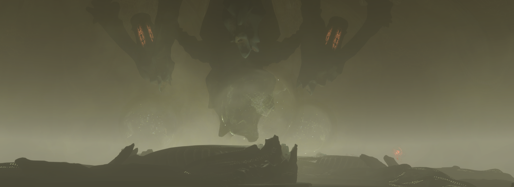
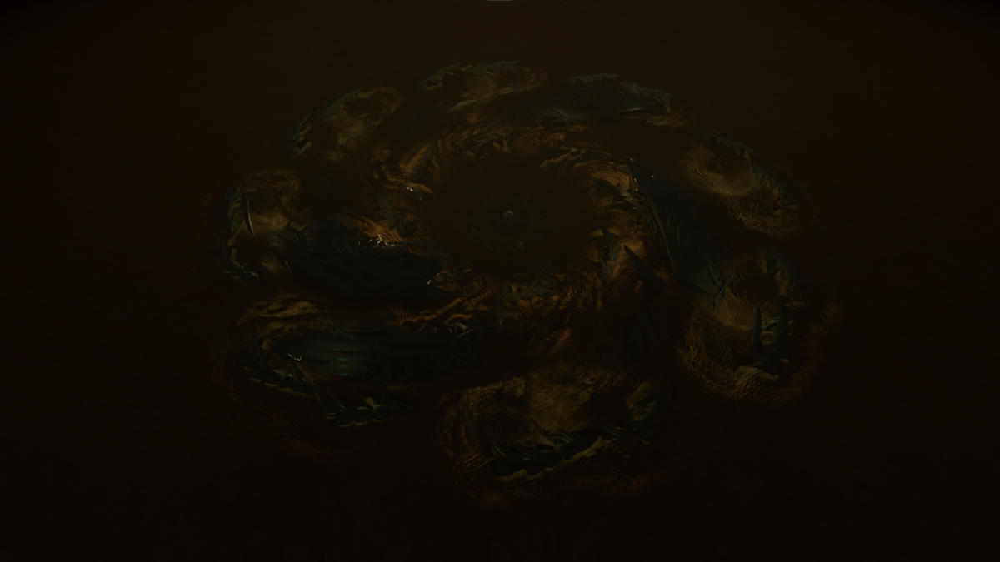
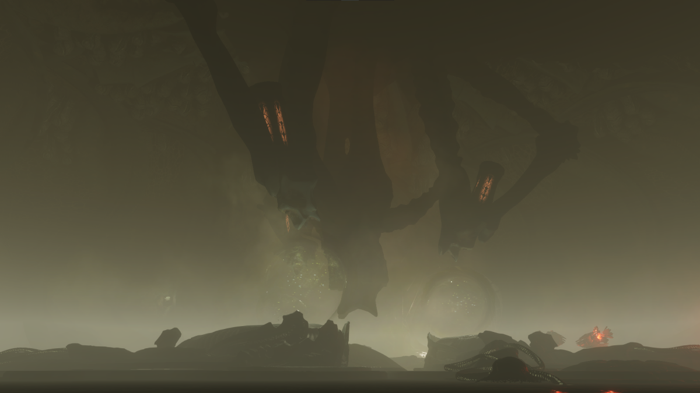
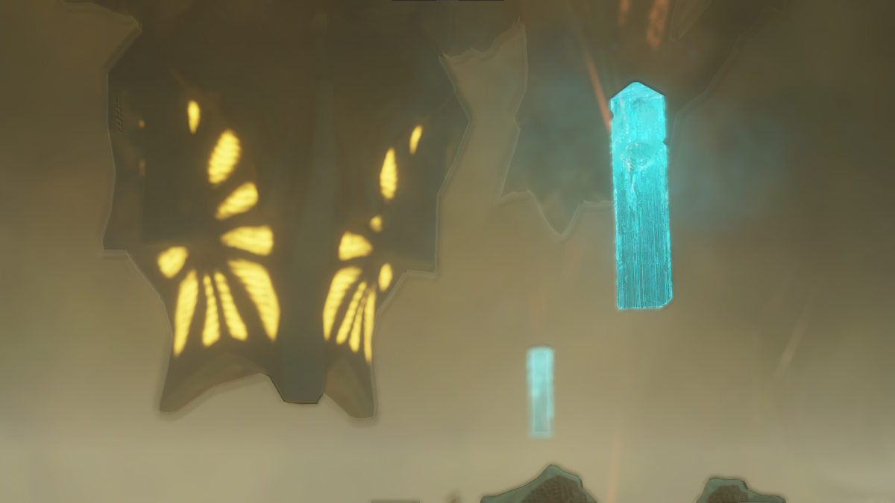
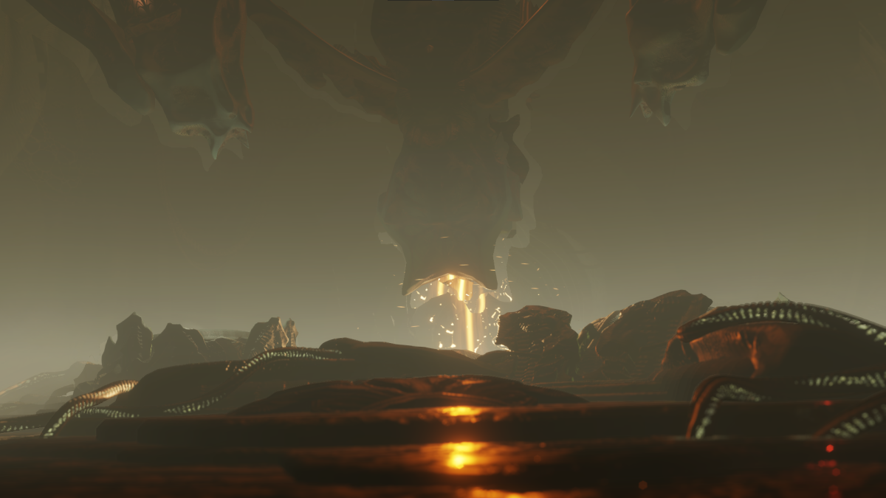
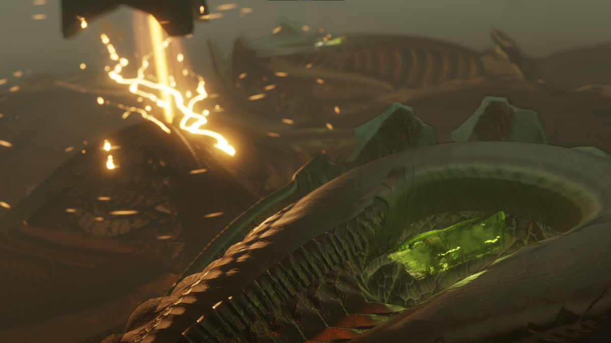

# Unclassified Relics

Unclassified Relics, commonly termed as "Grelics" or "green Jolly Ranchers" are a Guardian-Thargoid hybrid Relic, introduced as an unsellable commodity, and are obtained when converting Guardian Relics from a Thargoid Uplink Device found at Thargoid Structure Sites. Unclassified Relics are used in the TG Pulse Neutralizer module crafting recipe and is used to unlock Professor Ishmael Palin and Ram Tah, bypassing all initial meeting requirements. 

## Requirements

The goal of this guide is to explain how to obtain these Unclassified Relics. You will need a jump capable ship with the following necessary modules:

* A Fuel Scoop
* Corrosive Resistant Cargo Racks and enough room to hold 4 tons
* An engineered Frame Shift Drive
* A SRV Hanger that can support two SRV's, Scarab Type SRV is sufficient
* A Detailed Surface Scanner
* A Shield Generator and Shield Boosters

## Visitation to a Guardian Structure or Ruin

We need to visit a Guardian Structure or Ancient Ruin to collect at a minimum of 3 Guardian Relics. If you have not already, [this Guardian Blueprint guide](../collection/guardianblueprint.md) will show you where and how you can obtain Guardian Relics.

!!! warning "Thargoid Hyperdictions"

    If you are carrying any Guardian or Thargoid related commodities in your cargo hold.

    * Thargoids will only become hostile if they scanned you carrying any Guardian commodities.
    * Thargoids will also demand the turn over of Thargoid related commodities before eventually becoming hostile.

## Obtain Thargoid Sensors

Next, we will need to plot to the system with the [Crashed Thargoid ship](../collection/thargoidmats.md#thargoid-sensor-fragments). This is where the Corrosive Resistance Cargo Racks come into play as we need to collect an intact Thargoid Sensor. This will be used as a key to access our Thargoid Structure. You may also use this time to collect Sensor Fragments but it is not needed since the Unclassified Relics immediate unlocks Palin's services once you sell a unit to him.

## Locating a Thargoid Structure

We need to locate a Thargoid Structure and plot to it. Thargoid Structures can be active or dormant, we need to go to [an Active Thargoid Structure Site](https://docs.google.com/spreadsheets/d/1G79y2Sg-7lU8BDIpM_N0-mnS6BFqhe4va648J1wwnag/edit?gid=1625079279#gid=1625079279). When you enter into the system, you may need to Detail Surface Scan the surface to locate the exact point of where this Thargoid Structure is located. You will land near the central hub inside of the Thargoid Structure site.

### Landed & Preparation

Once Landed, you will need to deploy your SRV. 

* It is recommended to bring a Scarab SRV for this guide. Scorpions are heavier, bulkier, and carries less cargo.
* Transfer 1 Thargoid Sensor and 3 Guardian Relics.

You will need to locate the entrance to go inside the main hub of the Thargoid Structure.

### Inside the Thargoid Structure

You will need to navigate towards the center of the Thargoid Structure. Here, you will see a large device with 3 chambers. This device is called the Thargoid Uplink Device. You will need to drive over the glowing light and either Abandon or Jettison the Guardian Relic so that the Uplink Device is able to grab and hold the Guardian Relic. You will do this for all 3 chambers. 

Once everything is prepared, the Uplink Device will glow yellow, confirming that everything is set. You can activate the Uplink Device by targeting the device and data scanning it.

??? danger "Threats During Activation"

    

    Since Guardian technology is not of Thargoid origin, the Uplink device will try to reject it. However, in this case, the uplink device is overpowered by the signals of the failed Proteus Wave in HIP 22460 that it converts the Guardian Relics into Unclassified Relics. You will notice 3 things happening.

    * The Uplink Device is reacting violently in response to the Guardian technology in its chamber.
    * The Uplink Device will create a lot of heat.
    * The neutral Scavengers will become hostile and attack you.

    You can destroy all hostile contacts, and attempt to collect the Unclassified Relics. Your SRV may experience severe heat, however, it is always recommended to have synthesis needed for repairs and to take your time.

## Usage for Unclassified Relics

After you sucessfully obtained these Unclassified Relics, you may use them for two reasons. 

### Unlocking Palin or Ram Tah

You may use Unclassified Relics to unlock either Professor Ishmael Palin or Ram Tah, by flying into the system, which will prompt them to reach out to you. You will then fly to their engineering bases, and sell a unit of the Unclassified Relics to the engineer to access their services.

### Purchasing the TG Pulse Neutralizer

The TG Pulse Neutralizer is a Pulse Neutralizer, similar to the Shutdown Field Neutralizer used in AX Combat, that is used to protect ships from Massive Energy Surges produced by Thargoid Titans. The TG Pulse Neutralizer is only useful on Active Thargoid Titans, but can be used in replacement to the basic Shutdown Field Neutralizer. 

## Alternative Methods

Unclassified Relics is a commodity that can be stored on a player's Fleet Carrier. The downside is that since it is unclassified, it cannot be traded through the commodity market, and so an in-person trade will be required to obtain these Unclassified Relics without needing to go through those additional steps. If you feel like this is a hassle for yourself, to engage with another player to obtain an Unclassified Relic, then this guide is for you.

