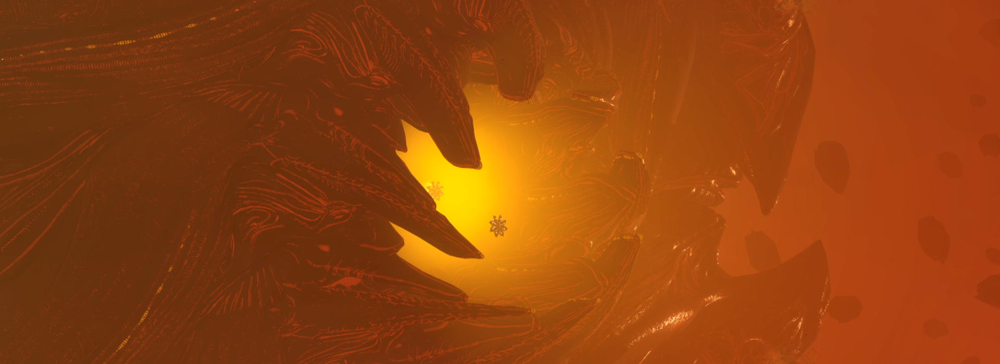
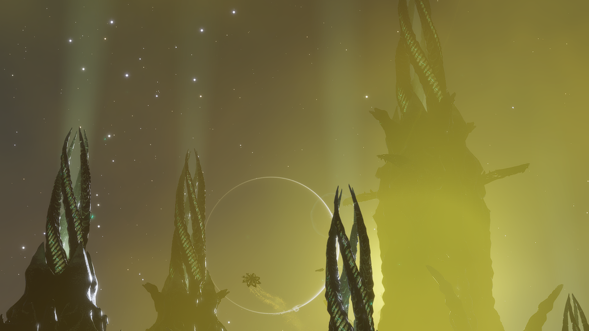
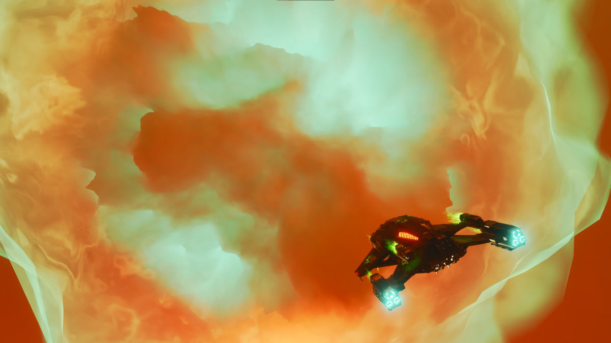
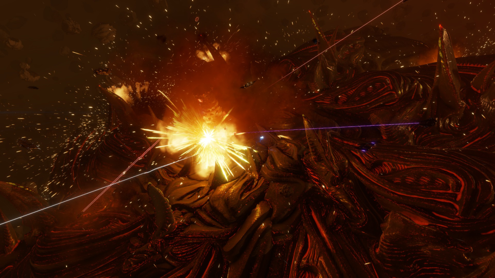
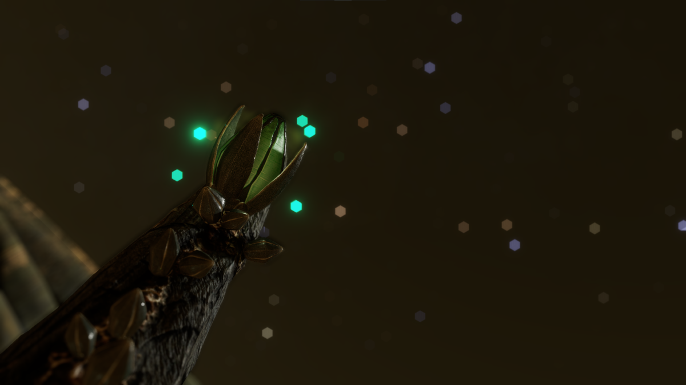

??? warning "Unobtainable Thargoid Materials"

    There are some unobtainable thargoid materials due to the completion of the Thargoid War. Currently, there are no activities or sources that generate the materials. 



# Thargoid Materials

Thargoids are a hostile territorial species from an unknown region with an unknown purpose. You can find engineering materials upon visiting Thargoid related point of interests, and engaging in Thargoid activities. Thargoid materials are often used for AX-weapon synthesis or to unlock experimentals. 

## Thargoid Materials

Thargoid materials come in forms of Manufactured and Encoded type materials. The Thargoids are a biomechanical and territorial species that are from an unknown source with an unknown purpose. Destroying Thargoid ships will get you salvage items to unlock more experimentals and synthesis for thargoid-related ammunition.

## Thargoid Manufactured Materials



Here are a list of Thargoid manufactured materials and their known sources

| Material | Rarity | Source |
| -------- | ------ | ------ |
| Thargoid Carapace | G2 | Destorying Scavengers |
| Thargoid Energy Cell | G3 | Destorying Scavengers |
| Thargoid Organic Circuitry | G5 | Destorying Scavengers |
| Thargoid Technology Component | G4 | Destorying Scavengers |
| Bio-Mechanical Conduits | G3 | Destroying Interceptors / Scouts / Glaives |
| Propulsion Elements | G3 | Destroying Interceptors / Scouts / Glaives |
| Weapon Parts | G3 | Destroying Interceptors / Scouts / Glaives |
| Wreckage Components | G3 | Destroying Interceptors / Scouts / Glaives |
| Sensor Fragment | G3 | Destroying Thargoid Sensors / Scavengers / Revenants / Banshees |

### Thargoid Sensor Fragments

Thargoid Sensor Fragments can be obtained from destroying Thargoid Sensors, Scavengers, Revenants, and Banshees. Although, the most common way of collecting Thargoid Sensor Fragments is to destroy Thargoid Sensors. These Sensors can be found from Crashed Sites, namely in the system;
```
HIP 17403
```
On planetary body A 4 A.

## Thargoid Encoded Materials



Here are a list of Thargoid encoded materials and their known sources

| Material | Rarity | Source |
| -------- | ------ | ------ |
| Thargoid Material Composition Data | G3 | Scan Thargoid Uplink Device on Surface Sites |
| Thargoid Residue Data | G5 | Scan Thargoid Uplink Device on Surface Sites |
| Thargoid Structural Data | G2 | Scan Thargoid Uplink Device on Surface Sites |
| Thargoid Ship Signature | G3 | Scan Interceptor / Scout / Glaives with AX Scanner |
| Ship Flight Data | G3 | Scan Interceptor / Scout / Glaives with AX Scanner |
| Ship Systems Data | G3 | Scan Interceptor / Scout / Glaives with AX Scanner |
| Thargoid Ship Signature | G3 | Scan Interceptor / Scout / Glaives with AX Scanner |
| Thargoid Wake Data | G4 | Scan Interceptor / Scout / Glaives Wake with Wake Scanner |

## Thargoid Titan Materials



Since the release of the new Elite Dangerous Live Update 14, new Thargoid materials were released as well. Currently some of the materials are unobtainable since the last destruction of the Thargoid Titan that happened in December of 2024. 

| Material | Rarity | Type | Source |
| -------- | ------ | ---- | ------ |
| Caustic Shard | G2 | Manufactured | Thargoid Maelstrom or Destroying Caustic Generators, Destroyed Titans |
| Caustic Crystal | G4 | Manufactured | Naturally spawns in Thargoid Maelstrom, Destroyed Titans |
| Corrosive Mechanism | G3 | Manufactured | Destroying Caustic Generators, Destroyed Titans |
| Hardened Surface Fragments | G1 | Manufactured | Deposits on Live Thargoid Titan Surfaces |
| Phasing Membrane Residue | G3 | Manufactured | Deposits on Live Thargoid Titan Surfaces |
| Heat Exposure Specimen | G5 | Manufactured | Deposits on Live Thargoid Titan Surfaces Heat Vents |
| Tactical Core Chip | G5 |  | Manufactured | Dropped by Revenants & Banshees |
| Massive Energy Surge Analytics | G3 | Encoded | Experience Shutdown in the Maelstrom or Banshee’s Shutdown Missiles |
| Thargoid Interdiction Telemetry | G3 | Encoded | Thargoid Interdiction Instances |

## Thargoid Commodities

There are two Thargoid-related commodities that are useful for you. These are the Meta-Alloys and the Unclassified Relics, both are extremely valuable to unlocking engineers.

<div class="grid cards" markdown>

-   __Meta Alloys__

    ---

    

    Meta Alloys are found on surface sites like [Thargoid Structure Sites](https://docs.google.com/spreadsheets/d/1G79y2Sg-7lU8BDIpM_N0-mnS6BFqhe4va648J1wwnag/edit?usp=sharing) and [Barnacle Forests](https://docs.google.com/spreadsheets/d/1giHvc1SISUcD7BPKjlbutkuwPrWQwHuSxnBwQ3MPQME/edit?usp=sharing). These Thargoid-related commodities is used to unlock Felicity Farseer, a tier 1 propulsion specialized engineer. Meta Alloys can also be purchased for credits from players with Fleet Carriers. 

-   __Unclassified Relics__

    ---

    

    After the Proteus Wave incident in HIP 22460, a new Guardian-Thargoid hybrid relic can be obtained by processing Guardian relics in any active Thargoid Structures. These unclassified relics cannot be sold on any market, however it can be used to bypass all prior meeting requirement and unlocking both Professor Palin and Ram Tah. 


