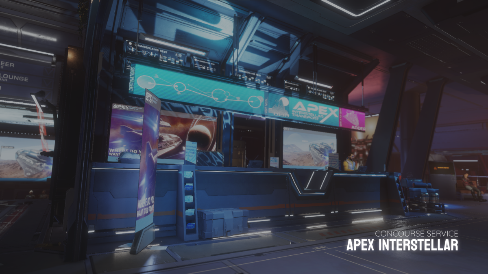

??? warning "Game Compatibility"

    You will need to have Elite Dangerous' only DLC, Odyssey bought and installed in order to start the game in Elite Dangerous Odyssey version.

# Welcome to Odyssey

Welcome to Elite Dangerous Odyssey. This is the expansion package for on-foot content in the game, Elite Dangerous. Let's look at the first steps you will take as a commander with on-foot access. The game puts you into their [Holo Me]() character builder. (1) 
{.annotate}

1.      Just note that Holo Me characters do not correspond to individual commander save files. You can have multiple Holo Me characters loadouts for one individual commander save file. 

The game will then put you into their tutorial gameplay. It is not necessary to complete this tutorial, but you will learn how to use some very basic gameplay mechanics. After completing this tutorial, or being absolutely confident in your First Person Shooter abilities and skipping the tutorial, the game will put you in a station called [Chamberlain's Rest]() in the [HIP 97950]() system. The game will loan you a free Sidewinder ship to start with. (1)
{.annotate}

1.     The game will also give you the options of [pre-built ships]() which instead of spending in-game currency, you can buy these pre-built ships with ARX currency. ARX is a cosmetic currency that is earned passively in the game by doing activities, or it can be purchased with money from the game's ARX store. 

## Chamberlain's Rest, HIP 97950

Chamberlain's Rest is a planetary starport in the system HIP 97950. This will be your starting point station and system. HIP 97950 is a permit-locked system controlled by the Pilot's Federation as a system for pilots who are rankless. 

### Looking around the Station

Every station will have a lounge area. In Elite Dangerous, we call it the "concourse". You'll notice for Chamberlain's Rest, there is an upper section, and a lower section with different shops and services. Let's take a look around the station.

#### Upper Section of the Station

- 

    === "Elevators to Shipyard"

        

        At the very back of the concourse area, you will see tube-like doors. These are elevators that accesses your ships. It is also the accessway when disembarking from the hanger bay to the concourse. 

    === "Apex Interstellar"

        

        Directly in front of you from the elevators, you will see a service shop on your left. This is the Apex Interstellar, a limited taxi service by demand, that is able to shuttle you between stations within the same system, or shuttle you to a destination in another populated system. 

        Apex Interstellar shuttles will require you to pay a small fee for however long the shuttle flies for. Apex shuttles can also be called to rescue you if you find your ship destroyed while exploring systems or planets that are within reach of apex's range.

        Accessing the elevators to your Apex shuttles can be located by walking past the service desk, turning left and crossing the bridge to the left of the station.

    === "Frontline Solutions"

        

        Frontline Solutions are a free-lance enlistment service that fulfills contracts by having the player enlist in joining a side if the system is experiencing a conflict between two factions. Frontier Solutions will fly out dropships to settlements in conflict, redeploy the player is they sustain critical injuries on the battelfield, and then fly back to the station.

        Accessing the elevators to your Frontier dropship can be located by walking past the enlistment table, turning right and crossing the bridge to the right of the station.

 

#### Lower Section of the Station

-   
    
    === "Pioneer Supplies"

        

        Pioneer Supplies is a market service where you are able to purchase weapons and suits. This is located near the bottom of the left staircase of the concourse. This is where you can buy fancy suits and weapons.
    
        This is where you are able to buy consumeables (1) as well. You may also be able to find rare and unique, pre-engineered or upgraded suits from other stations. (2) Pioneer Supplies will also be able to upgrade your suit and weapons, provided that you have sufficient materials gathered for each grade upgrade.
        {.annotate}

        1.  Consumeables such as; [Health Packs, Energy Packs, Grenades and E-breaches](#consumeables) can be purchased here. 

        2.  Pre-engineered suits and weapons are unique, meaning once it is bought, they disappear for everyone. Pre-engineered will always re-appear after server maintenance, which always happen on **Thursdays 7:00 AM UTC**.

    === "Inter Astra"

        

        Inter Astra is the service where you are able to make ship purchases, recall stored ships and call ships stored in other stations by administering deliveries. This service is located near the middle of the concourse. 
    
        If this is your first time accessing the Inter Astra, you will be prompted to start the Horizons ship flying tutorial, where you will be taught how to pilot your ship.

    === "Bartender"

        

        Towards the middle of the concourse, you will see a bar. The bar will not serve you drinks, but instead, they will offer to trade materials that you have gathered. (1)
        {.annotate}

        1.  Assets that you gathered can only be traded for other assets. Goods and Data can only be sold for credits. 

    === "Vista Genomics"

        

        Towards the opposite side of the Pioneer Supplies, you will see a service called Vista Genomics. Vista Genomics is a service to sell exobiology organic data samples. You will need an Artemis Suit to sample organic exobiology data.

#### Throughout the Concourse

-   
    
    === "Station Computers"

        

        Station Computers are a great way of accessing the system's factions and their missions, station services such as administrative contacts and accessing personal suit and weapon loadouts.

        ??? info "Computer Menu"

            

            * **Mission Board** provides you a list of available missions for all factions based on reputation, threat level and mission type. Missions that are completed can be collected from the Completed Missions tab.
            * **Administrative Contacts** allows you to pay off fines and bounties you may incur while exploring a system, there may be stations with interstellar factors where you are able to pay off any fine or bounty at a premium.
            * **Loadout** allows you to edit your personal loadout, edit your Holo Me character, and access vehicle extras and pre-built ships.

    === "Mission Givers"

        

        Mission Givers are unique personnel that gives missions however you may negotiate rewards, threat level access and mission objectives. 

        ??? info "Negotating a Mission"

            

            The amount of negotiation play depends on your reputation with that personnel's faction. The higher the reputation, the more negotiating room you will have with this mission giver. If the negotation fails, the mission giver will not offer anymore missions for a while. Negotations will affect pay, reputation, rewards and rank up.

## Personal Loadout & Equipment

For Odyssey, you will be given a basic flight suit and a weapon as your very basic loadout. You may purchase more specialized suits from any stations with a Pioneer Supplies market. There are three suits available to you to purchase, and a total of 11 kinds of weapons. 

### Suits

- 

    Suits are functional pieces of equipment that your character wears. Each suit has their own unique functionalities, and capacity. All suits will have a primary weapon slot, along with an Energy Link and a Profile Analyser tool. Your character will be given a free Flight Suit and a P-15 kinetic type pistol at the start. Let's take a look at the differences of every ship.

    === "Flight Suit"

        

        Flight suits are a very basic non-engineerable suit that pilots in Horizons will wear, along with the basic suit given to you at the very beginning of the game. There is nothing unique about this suit, other than it is worn by players who do not have Odyssey and can be cosmetically altered. (1)
        {.annotate}

        1.  You cannot purchase additional flight suits. You will only be given one Flight Suit per CMDR save file.

    === "Maverick Suit"

        

        Maverick suit is useful for salvaging materials from settlements and planetary points of interests. The Maverick suit has the largest carrying capacity, along with a special suit tool called the "Arc Cutter". The Arc Cutter is able to cut through access panels, and open locked crates with a red lock. The Maverick suit should be one of the first suits you should be considering to get as it's utilitarian versatility is great.

    === "Artemis Suit"

        

        If you are a keen explorer and you wish to go out and explore the galaxy on foot, then the Artemis Suit is a great option for you. It's life support and power consumption are the best out of the 4 suits making it a great suit to wear for exploring surfaces of planets for long term. The Artemis suit also comes with the Genetic Sampler, used to collect organic exobiology matter. Exobiology is one of the higher paying activities for early-game access.

    === "Dominator Suit"

        

        The Dominator suit, as the name suggests, is a combat-oriented suit. It does not have a suit-specific tool, but rather a carrying capacity for an extra secondary weapon. Dominator suits have the best armor and shield stats out of all 4 suits, making it a force to be reckoned with. This suit also has the highest consumeable carrying limit of any suits, making it a very heavy suit to move in.

### Weapons

-   

    Along with suits, you are also given a small list of weapons to use. Amongst the 3 brands, there are 4 weapon types. 

    === "Kinematic Armaments"

        

        Kinematic Armaments is the brand for all kinetic and explosive type handheld weapon.

        * Karma P-15 :octicons-dash-24: This is the default weapon that's given to you at the start.
        * Karma C-44 :octicons-dash-24: This is a SMG kinetic based weapon.
        * Karma AR-50 :octicons-dash-24: This is an Assault Rifle kinetic based weapon.
        * Karma L-6 :octicons-dash-24: This is a Rocket Launcher explosive based weapon.

    === "Takeda"

        

        Takeda is the brand for all thermal type handheld weapon.

        * TK Aphelion :octicons-dash-24: This is an Assault Rifle thermal based weapon.
        * TK Eclipse :octicons-dash-24: This is a SMG thermal based weapon.
        * TK Zenith :octicons-dash-24: This is a Pistol thermal based weapon.

    === "Manticore"

        

        Manticore is the brand for all plasma type handheld weapon.

        * Tormentor :octicons-dash-24: This is a Pistol plasma based weapon.
        * Intimidator :octicons-dash-24: This is a Shotgun plasma based weapon.
        * Oppressor :octicons-dash-24: This is a Assault Rifle plasma based weapon.
        * Execution :octicons-dash-24: This is a Marksman Rifle plasma based weapon.
    

### Consumeables

In Odyssey, your suit upgrade can carry a limited capacity of consumeables. Consumeable as the name suggest are items where the player can use while engaged with an activity. Consumeables can be purchased from Pioneer Supplies and they can be taken from settlements as well.

!!! warning inline end "E-breaches"

    You can only find E-breaches in stations controlled by a faction with **Anarchy** or **Communism** government types. 
    
    E-breaches are considered an illegal item, and if a settlement security guard scans you, a bounty will be placed on your head. So avoid being scanned if you are carrying E-breaches.

| Consumeable Item | Usage                    |
| ---------------- | ------------------------ |
| Health Pack      | Heals the player's health pool. |
| Energy Kit       | Replenishes your suit's battery. |
| Frag Grenade     | A fragmentation explosive device. |
| EMP Grenade      | A grenade that disable shields. |
| Shield Grenade   | A grenade that deploys a shield. |
| E-breaches       | A device that overrides controls on access panels. |

### Personal Loadouts

Now you have your personal loadouts and some handheld weapons, you can customize and save loadouts. You can make as many loadouts as you want based on the amount of handheld weapons and suits you have purchased and customized. You can name your loadout saves so you know what suit and weapon combination that loadout has. You can put the same handheld weapon with other suits. You can choose which loadout you are wearing, by;

* using the station computer to select and customize your loadouts.
* using the ship's role panel when seated in a ship.

 

## Early Game Activities

Alright, we have covered about concourse and its services, your suits and handheld weapons, let's look at some early access activities that is recommended for new Odyssey commanders. There are three paths one can take on, however you are not limited to taking only these three paths. 

* You can go and jump start in Exobiology. Exobiology is one of the more lucrative money-making activities for early access gameplay. All you need is a Artemis suit and a jump-capable ship. 
* You can purchase a Maverick suit and take on Restoration missions. Restoration missions's object is to power on an abandoned settlement. You are given level 3 access to all buildings in the settlement and therefore you can loot any materials left in this settlement at no risk of being caught.
* If you don't like Odyssey and wish to explore more of the systems within the core bubble, then you can pilot your Sidewinder and explore elsewhere. 

### Additional Resources

ED Handbook has multiple resources about Odyssey content, gameplway and mechanics. If you wish to look into it, you may check out the following guides to read up more in-depth guides for Elite Dangerous.

#### @ TO DO LIST