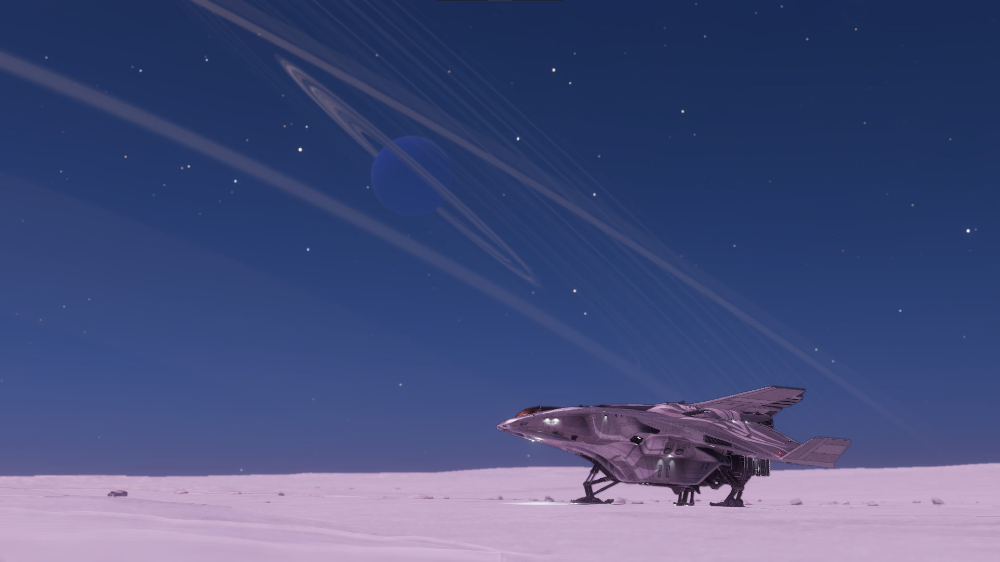
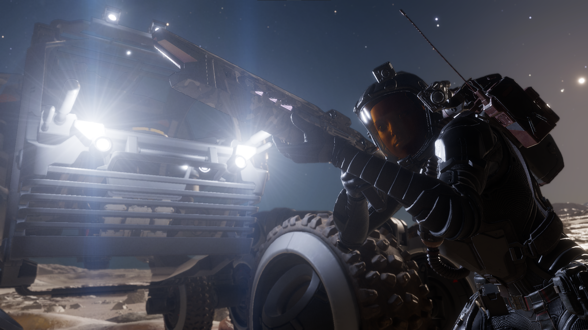

# Getting Started

Welcome to the Galaxy of Elite Dangerous. The setting is in the year 3310, in a near 1:1 recreation of our milky-way galaxy in model and scale. Luckily, space travel has advanced considerably to travel those vast distances. To the point that intermittent space and hyperspace jumps take mere minutes to traverse.

-   :octicons-feed-rocket-16: &nbsp; __[ED Horizons 4.0](edh.md)__

    

    Discover the galaxy in Elite: Dangerous Horizons.

-   :octicons-feed-person-16:&nbsp; __[ED Odyssey 4.0](edo.md)__

    

    Discover the galaxy in Elite: Dangerous Odyssey.

