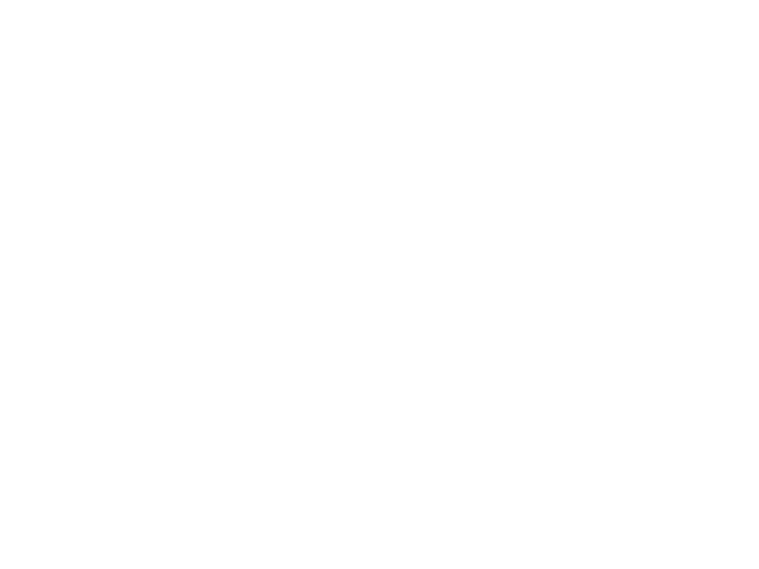
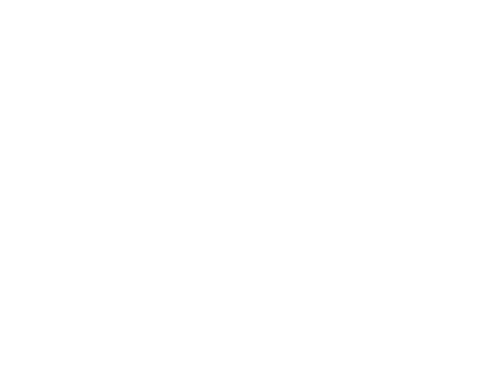

# PvE Combat Builds

Short paragraph: General notes on PvE builds (what are they good for, what not?)

## Early Progression - Small Ships

Short paragraph: General Notes on the progression

### Viper Mk.3

<a class="build-link" href="https://edsy.org/#/L=IM00000H4C0SC0,Hf500Hf500FBG00FBG00,CEg00CzY00,9on00A5U00AL600Aal00Aoo00B3_00BJc00BX_00,13q00,7Py0013q0020m001-C0010i0010i00,PvE_0Combat_0_D_0Basic" target="_blank" markdown>:material-open-in-new: Ship Build on EDSY</a>

{.build-image}
{.build-image-paragraph}

This would be a short description about the build

## Medium Ships

### Federal Assault Ship Layout 1

-   [:material-open-in-new: Build Your Own](https://edsy.org/#/L=IQ00000H4C0S00,mpUFBG00FBG00,,9p300AAo00AQQ00AeU00Au600B9I00BLo00Bb600,,7TM000720005U0005U00mpU0nG00)

    ---

    

-   

    === ":material-hexagon-outline: No Eng"

        Non Engineered features some basic outfitting principles, bi-weave shields, utility mounts and basic hardpoints for general combat.   

        [:material-open-in-new: ED Shipyard](https://edsy.org/#/L=IQ00000H4C0S00,mpUFBG00FBG00,,9p300AAo00AQQ00AeU00Au600B9I00BLo00Bb600,,7TM000720005U0005U00mpU0nG00){ .md-button }

    === ":material-hexagon-slice-3: Tier 1 Eng"

        Partially engineered ship features access to basic tier 1 engineers. These ships are adequate for some light to medium combat activities.   

        [:material-open-in-new: ED Shipyard](https://edsy.org/#/L=IQ00000H4C0S00,mpUFBG00FBG00,,9p300AAo00AQQ00AeU00Au600B9I00BLo00Bb600,,7TM000720005U0005U00mpU0nG00){ .md-button }

    === ":material-hexagon-slice-6: 100% Eng"

        Fully engineered ships are optimized to bring out the ship's maximum potential. These builds can be unique to their combat activities focus.   

        ??? abstract "Fully Engineered FAS Builds"

            * [:material-open-in-new: CZ Build](https://edsy.org/#/L=IQ00000H4C0S00,mpUFBG00FBG00,,9p300AAo00AQQ00AeU00Au600B9I00BLo00Bb600,,7TM000720005U0005U00mpU0nG00)

            * [:material-open-in-new: PvP Build](https://edsy.org/#/L=IQ00000H4C0S00,mpUFBG00FBG00,,9p300AAo00AQQ00AeU00Au600B9I00BLo00Bb600,,7TM000720005U0005U00mpU0nG00)

            * [:material-open-in-new: Pirate Build](https://edsy.org/#/L=IQ00000H4C0S00,mpUFBG00FBG00,,9p300AAo00AQQ00AeU00Au600B9I00BLo00Bb600,,7TM000720005U0005U00mpU0nG00)

### Federal Assault Ship Layout 2

=== ":material-hexagon-outline: No Eng"

    Non Engineered features some basic outfitting principles, bi-weave shields, utility mounts and basic hardpoints for general combat.   

    [:material-open-in-new: ED Shipyard](https://edsy.org/#/L=IQ00000H4C0S00,mpUFBG00FBG00,,9p300AAo00AQQ00AeU00Au600B9I00BLo00Bb600,,7TM000720005U0005U00mpU0nG00){ .md-button }

=== ":material-hexagon-slice-3: Tier 1 Eng"

    Partially engineered ship features access to basic tier 1 engineers. These ships are adequate for some light to medium combat activities.   

    [:material-open-in-new: ED Shipyard](https://edsy.org/#/L=IQ00000H4C0S00,mpUFBG00FBG00,,9p300AAo00AQQ00AeU00Au600B9I00BLo00Bb600,,7TM000720005U0005U00mpU0nG00){ .md-button }

=== ":material-hexagon-slice-6: 100% Eng"

    Fully engineered ships are optimized to bring out the ship's maximum potential. These builds can be unique to their combat activities focus. 

    ???+ info "Specialized Engineered Builds"

        === "Conflict Zone Build"

            This is a build specialized for Conflict Zones, it is good for Low to Medium intensity conflict zones, but may need additional support in High intensity conflict zones. 

            - [x] Great for Low and Medium intensity conflict zones.
            - [x] Has high alpha damage for close-range dogfighting style.
            - [ ] Isn't built for longevity PvE battles and will require frequent rearms or synthesis.
            - [ ] May need additional reinforcement for High intensity conflict zones.

        === "Combat Mission Build"

            This is a build specialized for dealing with Pirate Massacres and Assassination Missions

            - [x] Has these weapons that deal good penetrating damage.
            - [x] Can be exceptionally well built for Threat 4 mission-related signal sources.
            - [ ] May struggle with dealing with higher-threat assassination targets.

## Large Ships