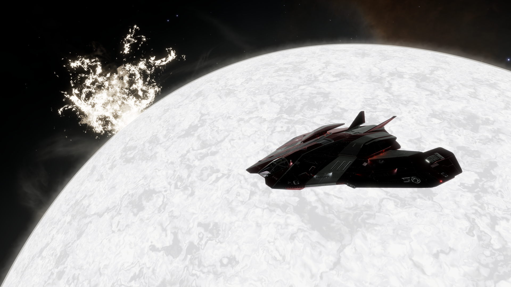
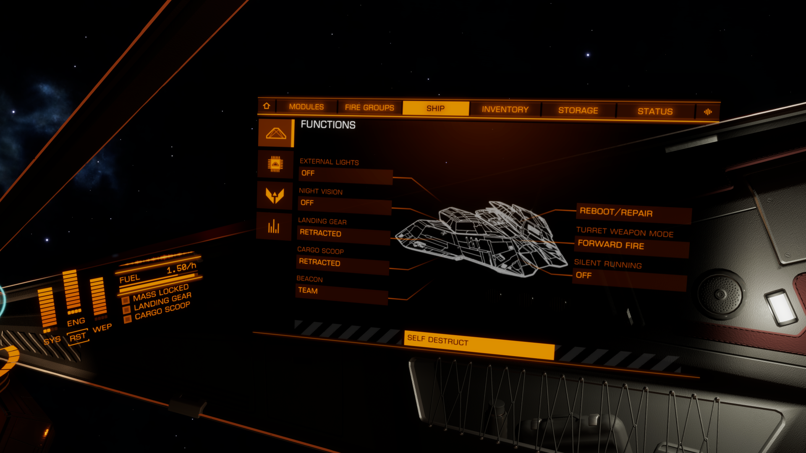

# Welcome to Exploration

Many commanders play Elite: Dangerous solely to explore the vast galaxy within the game, which is a 1:1 scale generation of our real-world Milky Way galaxy. As of February 2024, only 0.06% (1) of the entire galaxy has been explored by the playerbase since the game's launch, which leaves boundless opportunity for commanders to go out and find something no one has ever seen before. 
{.annotate}

1. This statistic comes from Frontier Development's "[Frontier Unlocked](https://www.twitch.tv/videos/2077109805?collection=Ha-dA50GsBcvDw&t=00h04m05s)" live stream on Twitch, February 18th 2024.

While some consider exploration to be its own reward, as the sights of the galaxy are something that makes Elite truly special, it can make very good money as well and can even serve as a commander's primary income for their other interests in Elite. Whatever your reason for wanting to travel out into the black, you should know the basics of exploration and the aspects that make up a skilled pilot. This involves using using the proper tools to collect valuable data and using proper techniques to travel efficiently and safely, as there are no stations in deep space to dock to in order to repair your ship if it gets damaged. Commanders who intend to reach far beyond the bubble are required to know how to survive on their own, thousands of light-years from civilization.

#### Things That Can Kill You

- 
    Below are the most common ways an explorer can die or become stuck, and how to avoid each outcome.
    === "Fuel"
        

        One of the most important things all explorers have to manage is their own ship's fuel. Since there are no stations to refill your tank when you run low, you'll have to get fuel for yourself, and running out of fuel means being completely stuck with only 2 options to get back home.

        - Self-Destruct 
            In the scenario that you have no fuel to jump to any systems and there are no fuel stars in range, the easiest way to get back home is to manually destroy your ship. Go to your internal panel (on your right side), go to the Ship tab, and at the bottom of the Functions section will be option to self destruct. (1) After you hit confirm, your ship will begin to build heat, causing internal damage until eventually the entire ship explodes as you leave through an escape pod. This will immediately bring you back to the last station or fleet carrier you docked to, but you will lose all of the data that you've aquired on your current trip. On top of that, you'll also have to pay the insurance cost of your ship in order to get a new one, otherwise you'll have to buy and outfit your ship all over again. Not an ideal outcome.
            {.annotate}

            1. 
        
        - Call for Help 
            Lucky for you, there's an entire player organization dedicated to helping players with no fuel, even if you're thousands of light years from the bubble. The Fuel Rats are a group of rescue ships purpose built for reaching stranded commanders and bringing fuel to their ships so they can get back home with all of their data.
        
    === "Internal Damage"
        The most common way for explorers to take internal damage to their ship's modules is from heat damage. When your ship gets too hot for the cooling systems to handle, your ship will begin to take internal damage and all of your modules will quickly lose inegrity. Most of your modules can still function with lowered integrity, but they may malfunction or negatively affect the performance of your ship. If your vital modules like your power plant lose too much integrity, you could be left in a situation where you can no longer make your way back home.

    === "Hull Damage"
        Of course, if your ship's hull integrity gets too low then your ship will just outright explode, leaving you stranded with no other option but to redeploy back in populated space without any of the data you've collected. Your hull can degrade from heat damage just like any of your internal modules, but you can also damage your hull by colliding with planets. For this reason it's always recommended to bring a shield generator, even if they add a little bit of mass to your ship.

#### How To Make Money

##### Universal Cartographics